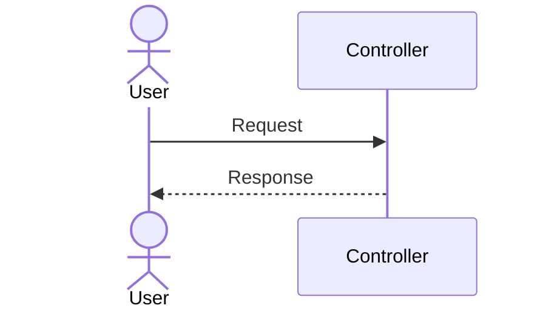

# 📐 Diagrammes techniques – ToDo & Co

## 🎯 Objectif

Ce dossier regroupe les principaux diagrammes techniques de l'application ToDo & Co.

Ces diagrammes ont pour objectif de fournir une représentation visuelle de l'architecture, des données et du fonctionnement de l'application afin de faciliter :

- la compréhension du projet ;
- la maintenance de l'application ;
- l'arrivée de nouveaux développeurs ;
- l'analyse des règles métier ;
- l'évolution future de l'application.

Les diagrammes correspondent à l'architecture finale de l'application après les différentes évolutions réalisées dans le cadre du projet OpenClassrooms.

Chaque diagramme est disponible :

- en **Markdown avec Mermaid**, afin de conserver un diagramme versionnable et facilement modifiable ;
- en **PNG**, afin de pouvoir être intégré dans des documents, rapports ou présentations.

---

## 📚 Diagrammes disponibles

### 🔐 Diagrammes de cas d'utilisation

Les diagrammes de cas d'utilisation présentent les principales fonctionnalités de l'application et les droits associés aux différents acteurs.

Ils sont répartis en plusieurs diagrammes afin de conserver une représentation claire et lisible.

#### 🔐 Authentification

📄 [`use-case/authentication.md`](use-case/authentication.md)  
🖼️ [`use-case/authentication.png`](use-case/authentication.png)

Présente les cas d'utilisation liés à :

- la connexion ;
- la déconnexion.

---

#### 📋 Gestion des tâches

📄 [`use-case/task-management.md`](use-case/task-management.md)  
🖼️ [`use-case/task-management.png`](use-case/task-management.png)

Présente les cas d'utilisation liés à :

- la consultation des tâches ;
- la création d'une tâche ;
- la modification d'une tâche ;
- le changement d'état d'une tâche ;
- la suppression d'une tâche ;
- la suppression des tâches `anonymous` par un administrateur.

Le diagramme représente également la spécialisation de l'administrateur par rapport à l'utilisateur.

---

#### 👥 Gestion des utilisateurs

📄 [`use-case/user-management.md`](use-case/user-management.md)  
🖼️ [`use-case/user-management.png`](use-case/user-management.png)

Présente les fonctionnalités accessibles à l'administrateur :

- consulter les utilisateurs ;
- créer un utilisateur ;
- modifier un utilisateur ;
- modifier le rôle d'un utilisateur.

---

### 🗄️ Modèle physique de données

Le modèle physique de données représente la structure réelle de la base de données MySQL utilisée par l'application.

📄 [`data-model.md`](data-model.md)  
🖼️ [`data-model.png`](data-model.png)

Il présente notamment :

- la table `user` ;
- la table `task` ;
- la table `doctrine_migration_versions` ;
- les types SQL ;
- les clés primaires ;
- les clés étrangères ;
- les contraintes `UNIQUE` ;
- les contraintes `NOT NULL` ;
- les index ;
- les relations entre les tables.

Le modèle a été vérifié directement dans la base de données MySQL et comparé au mapping Doctrine.

---

### 🧩 Diagramme de classes

Le diagramme de classes présente les principaux composants applicatifs et leurs relations.

📄 [`class-diagram.md`](class-diagram.md)  
🖼️ [`class-diagram.png`](class-diagram.png)

Il présente notamment :

- les entités ;
- les contrôleurs ;
- les formulaires ;
- le système d'autorisation ;
- les principaux composants intervenant dans la gestion des tâches et des utilisateurs.

---

### 🔄 Diagrammes de séquence

Les diagrammes de séquence représentent les principaux parcours fonctionnels de l'application.

Ils permettent notamment de visualiser les interactions entre :

```text
Utilisateur
     ↓
Navigateur
     ↓
Contrôleur
     ↓
Symfony Security / Voter
     ↓
Doctrine
     ↓
Base de données
```

---

#### 🔐 Authentification

📄 [`sequence/authentication.md`](sequence/authentication.md)  
🖼️ [`sequence/authentication.png`](sequence/authentication.png)

Représente le processus d'authentification d'un utilisateur :

- soumission du formulaire de connexion ;
- recherche de l'utilisateur ;
- récupération des données depuis la base ;
- vérification du mot de passe ;
- création de la session authentifiée ;
- gestion d'une authentification échouée.

---

#### ➕ Création d'une tâche

📄 [`sequence/create-task.md`](sequence/create-task.md)  
🖼️ [`sequence/create-task.png`](sequence/create-task.png)

Représente le processus de création d'une tâche et son association automatique à l'utilisateur authentifié.

Le diagramme présente notamment :

- l'affichage du formulaire ;
- la soumission des données ;
- la validation du formulaire ;
- la récupération de l'utilisateur authentifié ;
- l'association entre la tâche et son auteur ;
- la persistance de la tâche en base de données.

---

#### ✏️ Modification d'une tâche

📄 [`sequence/edit-task.md`](sequence/edit-task.md)  
🖼️ [`sequence/edit-task.png`](sequence/edit-task.png)

Représente la modification d'une tâche et le contrôle de son propriétaire par `TaskVoter`.

Le diagramme distingue :

- l'utilisateur propriétaire de la tâche ;
- l'utilisateur qui n'est pas propriétaire ;
- l'autorisation de modification ;
- le refus avec une réponse `403 Forbidden`.

---

#### 🗑️ Suppression d'une tâche

📄 [`sequence/delete-task.md`](sequence/delete-task.md)  
🖼️ [`sequence/delete-task.png`](sequence/delete-task.png)

Représente les règles d'autorisation appliquées lors de la suppression d'une tâche.

Le diagramme prend notamment en compte :

- le propriétaire de la tâche ;
- un autre utilisateur ;
- l'utilisateur `anonymous` ;
- le rôle `ROLE_ADMIN` ;
- le refus d'accès avec une réponse `403 Forbidden`.

---

#### 👥 Gestion des utilisateurs

📄 [`sequence/manage-user.md`](sequence/manage-user.md)  
🖼️ [`sequence/manage-user.png`](sequence/manage-user.png)

Représente les interactions liées à la gestion des utilisateurs et au contrôle du rôle administrateur.

Le diagramme présente notamment :

- l'accès à `/users` ;
- la vérification de `ROLE_ADMIN` ;
- la création d'un utilisateur ;
- la modification d'un utilisateur ;
- la modification de son rôle ;
- la persistance des données en base.

---

## 🔐 Principales règles métier représentées

Les diagrammes permettent notamment de visualiser les règles suivantes.

### Association des tâches

Chaque tâche est associée à un utilisateur.

Lors de sa création, l'utilisateur authentifié est automatiquement associé à la tâche.

### Propriétaire d'une tâche

L'auteur d'une tâche ne peut pas être modifié lors de son édition.

### Modification et changement d'état

Un utilisateur peut modifier ou changer l'état de ses propres tâches.

Il ne peut pas modifier les tâches appartenant à un autre utilisateur.

### Suppression

Une tâche peut être supprimée par son créateur.

Une tâche associée à `anonymous` peut uniquement être supprimée par un administrateur.

### Gestion des utilisateurs

L'accès aux pages de gestion des utilisateurs est réservé aux utilisateurs possédant :

```text
ROLE_ADMIN
```

### Rôles

Les rôles disponibles sont :

```text
ROLE_USER
ROLE_ADMIN
```

---

## 🛠️ Technologie utilisée

Les diagrammes sont écrits en **Mermaid** directement dans les fichiers Markdown.

Exemple :



Cette approche permet de conserver les diagrammes sous forme de code source et de les versionner avec Git.

Les versions PNG sont générées à partir des diagrammes afin de permettre leur utilisation dans :

- les rapports ;
- la documentation PDF ;
- les présentations ;
- la soutenance.

---

## 👀 Visualisation

Les diagrammes Mermaid peuvent être visualisés directement sur les plateformes compatibles avec Mermaid, notamment GitHub.

Ils peuvent également être ouverts dans un éditeur prenant en charge le rendu Mermaid.

Les fichiers PNG permettent quant à eux de consulter les diagrammes sans nécessiter le rendu Mermaid.

Le code source du diagramme reste toujours accessible dans chaque fichier `.md`, ce qui permet de le modifier facilement.

---

## 📁 Organisation

```text
diagrams/
│
├── README.md
│
├── use-case/
│   ├── authentication.md
│   ├── authentication.png
│   ├── task-management.md
│   ├── task-management.png
│   ├── user-management.md
│   └── user-management.png
│
├── data-model.md
├── data-model.png
│
├── class-diagram.md
├── class-diagram.png
│
└── sequence/
    ├── authentication.md
    ├── authentication.png
    ├── create-task.md
    ├── create-task.png
    ├── edit-task.md
    ├── edit-task.png
    ├── delete-task.md
    ├── delete-task.png
    ├── manage-user.md
    └── manage-user.png
```

---

## 🔄 Maintenance

Les diagrammes doivent être mis à jour lorsque l'architecture ou les règles métier représentées évoluent.

Toute modification importante concernant :

- les entités ;
- les relations entre entités ;
- les contrôleurs ;
- les règles d'autorisation ;
- les parcours fonctionnels ;
- la structure de la base de données ;

doit être accompagnée de la mise à jour du ou des diagrammes concernés.

Lorsqu'un fichier Mermaid `.md` est modifié, sa version `.png` doit également être régénérée afin de conserver les deux représentations synchronisées.

L'objectif est de conserver une documentation graphique cohérente avec le code source de l'application.
