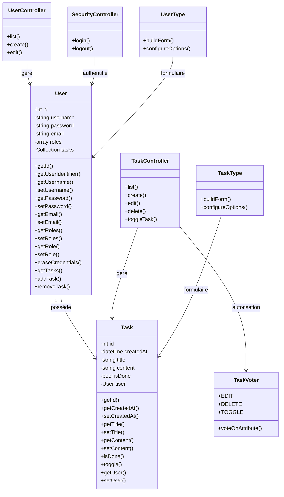

# 🧩 Diagramme de classes — ToDo & Co

## 🎯 Objectif

Ce document présente le diagramme de classes de l'application ToDo & Co.

Contrairement au modèle physique de données, qui représente la structure de la base MySQL, le diagramme de classes présente la structure objet de l'application Symfony.

Il permet notamment de visualiser :

- les principales entités métier ;
- les contrôleurs ;
- les formulaires ;
- le composant d'autorisation ;
- les relations entre les différentes classes ;
- les principales responsabilités de chaque composant.

Le diagramme se concentre sur les composants directement concernés par les fonctionnalités développées dans le cadre du projet.

---

## 📊 Diagramme de classes



---

## 👤 Classe `User`

La classe `User` représente un utilisateur de l'application.

Elle implémente les interfaces Symfony nécessaires à l'authentification :

```php
UserInterface
PasswordAuthenticatedUserInterface
```

Elle contient notamment :

- l'identifiant ;
- le nom d'utilisateur ;
- le mot de passe ;
- l'adresse email ;
- les rôles ;
- la collection des tâches associées.

Les rôles disponibles dans l'application sont notamment :

```text
ROLE_USER
ROLE_ADMIN
```

La méthode `getRoles()` garantit également qu'un utilisateur dispose au minimum du rôle `ROLE_USER`.

### Gestion des tâches

La classe `User` possède une relation avec `Task` :

```text
User 1 ─────── 0..* Task
```

Un utilisateur peut donc être associé à plusieurs tâches.

Les méthodes :

```php
addTask()
removeTask()
getTasks()
```

permettent de gérer cette collection.

---

## 📋 Classe `Task`

La classe `Task` représente une tâche de l'application.

Elle contient notamment :

- l'identifiant ;
- la date de création ;
- le titre ;
- le contenu ;
- l'état de la tâche ;
- l'utilisateur auquel la tâche est rattachée.

La relation avec `User` est définie par :

```php
#[ORM\ManyToOne(
    targetEntity: User::class,
    inversedBy: 'tasks'
)]
#[ORM\JoinColumn(nullable: false)]
```

Une tâche doit donc obligatoirement être associée à un utilisateur.

Lors de sa création, certaines propriétés sont initialisées directement dans le constructeur :

```php
$this->createdAt = new \Datetime();
$this->isDone = false;
```

---

## 🎮 Classe `TaskController`

`TaskController` gère les principales opérations liées aux tâches.

Ses responsabilités comprennent notamment :

```text
Lister les tâches
Créer une tâche
Modifier une tâche
Supprimer une tâche
Changer l'état d'une tâche
```

Le contrôleur travaille notamment avec l'entité `Task` et le composant `TaskVoter` lorsqu'une vérification d'autorisation est nécessaire.

Le contrôleur ne contient donc pas directement l'ensemble des règles d'autorisation métier.

---

## 👥 Classe `UserController`

`UserController` gère les fonctionnalités d'administration relatives aux utilisateurs.

Ses principales opérations sont :

```text
Lister les utilisateurs
Créer un utilisateur
Modifier un utilisateur
```

La modification d'un utilisateur permet également de modifier son rôle.

L'accès à ces fonctionnalités est réservé aux utilisateurs possédant :

```text
ROLE_ADMIN
```

---

## 🔐 Classe `SecurityController`

`SecurityController` intervient dans le processus d'authentification.

Il gère notamment :

```text
/login
/logout
```

L'authentification elle-même est prise en charge par le composant Symfony Security.

Le contrôleur constitue donc le point d'entrée du parcours de connexion, tandis que Symfony Security assure la vérification des identifiants et l'identification de l'utilisateur.

---

## 🛡️ Classe `TaskVoter`

`TaskVoter` centralise les principales règles d'autorisation concernant les tâches.

Les attributs utilisés sont :

```php
EDIT
DELETE
TOGGLE
```

Le voter vérifie notamment :

- si l'utilisateur est authentifié ;
- si l'utilisateur est propriétaire de la tâche ;
- si la tâche appartient à `anonymous` ;
- si l'utilisateur possède le rôle `ROLE_ADMIN`.

### Règles principales

Pour la modification :

```text
Utilisateur propriétaire
        ↓
     Autorisé
```

Pour le changement d'état :

```text
Utilisateur propriétaire
        ↓
     Autorisé
```

Pour la suppression :

```text
Tâche appartenant à l'utilisateur
        ↓
     Autorisé
```

Pour une tâche `anonymous` :

```text
Tâche anonymous
        ↓
ROLE_ADMIN ?
   ↙          ↘
 Oui          Non
  ↓            ↓
Autorisé     Refusé
```

Cette centralisation permet de séparer les règles d'autorisation de la logique des contrôleurs.

---

## 📝 Classe `TaskType`

`TaskType` représente le formulaire Symfony utilisé pour créer et modifier une tâche.

Il permet notamment de gérer les champs liés à :

```text
title
content
```

L'utilisateur propriétaire n'est pas un champ sélectionnable dans le formulaire.

Lors de la création, l'association entre la tâche et l'utilisateur authentifié est réalisée par l'application.

Cette approche empêche un utilisateur de choisir arbitrairement le propriétaire d'une nouvelle tâche.

---

## 👤 Classe `UserType`

`UserType` représente le formulaire Symfony utilisé pour créer et modifier un utilisateur.

Il permet notamment de gérer :

```text
username
password
email
role
```

Le rôle peut prendre les valeurs :

```text
ROLE_USER
ROLE_ADMIN
```

La gestion du rôle est ainsi intégrée au processus de création et de modification d'un utilisateur.

---

## 🔗 Relations principales

Le diagramme met en évidence plusieurs relations entre les composants.

### `User` et `Task`

```text
User 1 ───────── 0..* Task
```

Un utilisateur peut posséder plusieurs tâches.

Une tâche appartient à un seul utilisateur.

---

### `TaskController` et `Task`

```text
TaskController ──────> Task
```

Le contrôleur manipule l'entité `Task` pour effectuer les opérations liées aux tâches.

---

### `UserController` et `User`

```text
UserController ──────> User
```

Le contrôleur manipule l'entité `User` pour les opérations d'administration.

---

### `TaskController` et `TaskVoter`

```text
TaskController ──────> TaskVoter
```

Le contrôleur s'appuie sur le voter pour vérifier les droits d'accès aux opérations protégées sur les tâches.

---

### Formulaires et entités

```text
TaskType ──────> Task

UserType ──────> User
```

Les classes de formulaire sont associées aux entités qu'elles permettent de créer ou de modifier.

---

## 🏗️ Organisation des composants

Les principales classes représentées dans ce diagramme sont organisées dans Symfony de la manière suivante :

```text
src/
│
├── Controller/
│   ├── SecurityController.php
│   ├── TaskController.php
│   └── UserController.php
│
├── Entity/
│   ├── Task.php
│   └── User.php
│
├── Form/
│   ├── TaskType.php
│   └── UserType.php
│
└── Security/
    └── Voter/
        └── TaskVoter.php
```

Cette organisation correspond à la structure Symfony Flex actuelle du projet.

---

## 🔐 Séparation des responsabilités

Le diagramme permet également de visualiser la séparation des responsabilités :

```text
User / Task
     ↓
   Entités
     ↓
TaskController / UserController
     ↓
    Actions
     ↓
TaskVoter
     ↓
Autorisation
```

Les formulaires sont quant à eux séparés dans :

```text
Form/
```

Cette organisation contribue à rendre le code plus lisible et plus facilement maintenable.

---

## 🎯 Objectif du diagramme

Ce diagramme permet de visualiser la structure objet de l'application et les relations entre ses principaux composants.

Il est complémentaire des autres diagrammes du projet :

- `use-case/authentication.md` — fonctionnalités liées à l'authentification ;
- `use-case/task-management.md` — fonctionnalités liées aux tâches ;
- `use-case/user-management.md` — fonctionnalités d'administration ;
- `data-model.md` — structure physique de la base de données ;
- les diagrammes de séquence du dossier `sequence/` — déroulement des principaux parcours.

Le **diagramme de classes** décrit donc principalement **comment l'application est structurée**, tandis que le **modèle physique de données** décrit **comment les données sont réellement stockées en base**.
