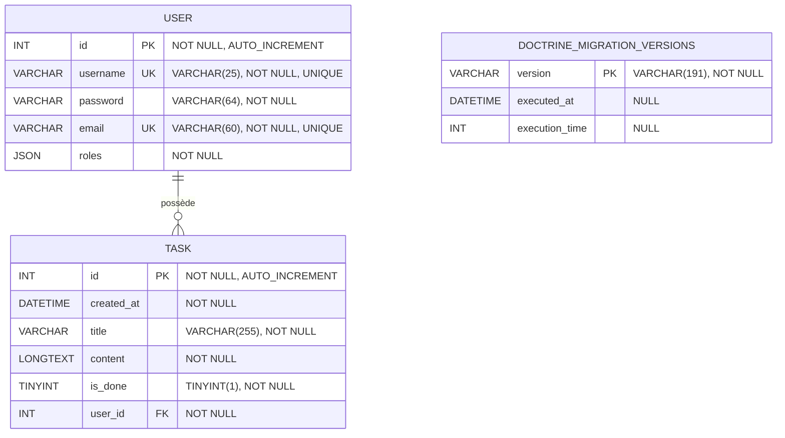

# 📊 Modèle physique de données — ToDo & Co

## 🎯 Objectif

Ce document présente le modèle physique de données de l'application ToDo & Co.

Contrairement à un modèle conceptuel ou à un simple diagramme des entités Doctrine, ce modèle représente la structure réelle de la base de données MySQL utilisée par l'application.

Les informations présentées ont été vérifiées directement dans la base de données après validation du mapping Doctrine.

---

## 🗄️ Base de données

L'application utilise une base de données :

```text
MySQL 5.7.44
```

La base utilisée par l'application est :

todolist

Le schéma Doctrine a été vérifié avec :

```bash
docker compose exec php php bin/console doctrine:schema:validate
```

Résultat :

```text
[OK] The mapping files are correct.


[OK] The database schema is in sync with the mapping files.
```

Le mapping Doctrine et la structure réelle de la base sont donc cohérents.

---

## 📊 Modèle physique

Le modèle physique de données représente les tables présentes dans la base todolist, leurs colonnes ainsi que la relation entre les tables métier.



---

## 👤 Table `user`

La table `user` contient les comptes utilisateurs de l'application.

| Colonne    | Type MySQL    | NULL | Clé    | Valeur par défaut | Particularité            |
| ---------- | ------------- | ---- | ------ | ----------------- | ------------------------ |
| `id`       | `INT(11)`     | NON  | PK     | `NULL`            | `AUTO_INCREMENT`         |
| `username` | `VARCHAR(25)` | NON  | UNIQUE | `NULL`            | Nom d'utilisateur unique |
| `password` | `VARCHAR(64)` | NON  | —      | `NULL`            | Mot de passe hashé       |
| `email`    | `VARCHAR(60)` | NON  | UNIQUE | `NULL`            | Adresse email unique     |
| `roles`    | `JSON`        | NON  | —      | `NULL`            | Rôles de l'utilisateur   |

---

### Clé primaire

La colonne :

```text
user.id
```

constitue la clé primaire de la table.

Elle est automatiquement incrémentée par MySQL.

---

### Contraintes d'unicité

Deux colonnes disposent d'une contrainte `UNIQUE` :

```text
username
email
```

La base empêche donc l'enregistrement de deux utilisateurs possédant :

- le même nom d'utilisateur ;
- la même adresse email.

Les contraintes sont matérialisées par les index uniques :

```text
UNIQ_8D93D649F85E0677
UNIQ_8D93D649E7927C74
```

---

### Rôles

La colonne :

```text
roles
```

est stockée au format :

```text
JSON
```

Elle permet de conserver les rôles associés à l'utilisateur.

L'application utilise notamment :

```text
ROLE_USER
ROLE_ADMIN
```

---

## ✅ Table `task`

La table `task` contient les tâches de l'application.

| Colonne      | Type MySQL     | NULL | Clé | Valeur par défaut | Particularité            |
| ------------ | -------------- | ---- | --- | ----------------- | ------------------------ |
| `id`         | `INT(11)`      | NON  | PK  | `NULL`            | `AUTO_INCREMENT`         |
| `created_at` | `DATETIME`     | NON  | —   | `NULL`            | Date de création         |
| `title`      | `VARCHAR(255)` | NON  | —   | `NULL`            | Titre de la tâche        |
| `content`    | `LONGTEXT`     | NON  | —   | `NULL`            | Contenu de la tâche      |
| `is_done`    | `TINYINT(1)`   | NON  | —   | `NULL`            | État de la tâche         |
| `user_id`    | `INT(11)`      | NON  | FK  | `NULL`            | Utilisateur propriétaire |

---

### Clé primaire

La colonne :

```text
task.id
```

constitue la clé primaire de la table.

Elle est automatiquement incrémentée par MySQL.

---

## 🔗 Relation entre `user` et `task`

Une relation entre les deux tables permet d'associer chaque tâche à son utilisateur.

```text
user.id
   │
   │ 1
   │
   │
   │ N
   ▼
task.user_id
```

Un utilisateur peut donc posséder plusieurs tâches.

Une tâche appartient obligatoirement à un utilisateur.

Cette contrainte est matérialisée par :

```sql
FOREIGN KEY (`user_id`) REFERENCES `user` (`id`)
```

et par :

```sql
`user_id` int(11) NOT NULL
```

La colonne `user_id` ne peut donc pas être `NULL`.

---

## 🔒 Contraintes d'intégrité

Le modèle physique applique plusieurs contraintes importantes.

### Clés primaires

```text
user.id
task.id
```

identifient de manière unique chaque enregistrement.

### Clés étrangères

```text
task.user_id → user.id
```

garantit qu'une tâche référence un utilisateur existant.

### Contraintes UNIQUE

```text
user.username
user.email
```

doivent être uniques.

### Contraintes `NOT NULL`

Toutes les colonnes des deux tables sont actuellement définies comme `NOT NULL`.

Cela concerne notamment :

```text
user.username
user.password
user.email
user.roles

task.created_at
task.title
task.content
task.is_done
task.user_id
```

---

## ⚙️ Valeurs par défaut

Aucune colonne des tables `user` et `task` ne possède actuellement de valeur `DEFAULT` définie au niveau SQL.

Les valeurs initiales de certaines propriétés sont cependant définies au niveau PHP.

Par exemple, lors de la création d'une `Task` :

```php
$this->createdAt = new \Datetime();
$this->isDone = false;
```

La date de création et l'état initial de la tâche sont donc initialisés par l'application et non par une valeur `DEFAULT` MySQL.

De la même manière, les rôles sont initialisés côté PHP :

```php
$this->roles = [];
```

---

## 🧩 Correspondance Doctrine / base de données

La structure SQL correspond aux mappings présents dans les entités.

`User`

```php
#[ORM\Column(type: 'string', length: 25, unique: true)]
private $username;

#[ORM\Column(type: 'string', length: 60, unique: true)]
private $email;

#[ORM\Column(type: 'json')]
private $roles = [];
```

`Task`

```php
#[ORM\ManyToOne(targetEntity: User::class, inversedBy: 'tasks')]
#[ORM\JoinColumn(nullable: false)]
private ?User $user = null;
```

Le mapping Doctrine permet ainsi de représenter la relation :

```text
User 1 ─────── N Task
```

---

## 🔎 Vérification de la structure SQL

La structure physique a été vérifiée directement avec MySQL à l'aide des commandes :

```sql
SHOW CREATE TABLE user;
SHOW CREATE TABLE task;

DESCRIBE user;
DESCRIBE task;

SHOW INDEX FROM user;
SHOW INDEX FROM task;
```

Ces vérifications ont notamment permis de confirmer :

- les types SQL ;
- les clés primaires ;
- les clés étrangères ;
- les contraintes `UNIQUE` ;
- les contraintes `NOT NULL` ;
- les index ;
- les valeurs par défaut ;
- l'auto-incrémentation des identifiants.

---

## 🎯 Synthèse

Le modèle physique de ToDo & Co repose sur deux tables principales :

```text
USER
│
│ 1
│
│ N
▼
TASK
```

Les principales contraintes sont :

| Élément           | Contrainte             |
| ----------------- | ---------------------- |
| `user.id`         | PRIMARY KEY            |
| `user.username`   | UNIQUE + NOT NULL      |
| `user.email`      | UNIQUE + NOT NULL      |
| `task.id`         | PRIMARY KEY            |
| `task.user_id`    | FOREIGN KEY + NOT NULL |
| `task.created_at` | NOT NULL               |
| `task.title`      | NOT NULL               |
| `task.content`    | NOT NULL               |
| `task.is_done`    | NOT NULL               |
| `user.roles`      | JSON + NOT NULL        |

Le modèle physique reflète ainsi la structure réelle de la base MySQL utilisée par l'application au terme du projet.
