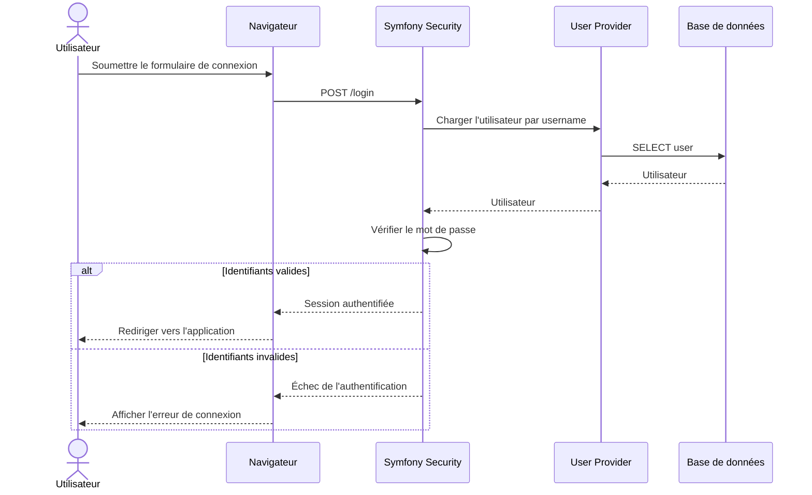

# 🔐 Diagramme de séquence — Authentification

## 🎯 Objectif

Ce diagramme représente le parcours d'authentification d'un utilisateur dans ToDo & Co.

Il présente les principales étapes permettant à Symfony Security d'identifier l'utilisateur et de vérifier son mot de passe.

---

## 📊 Diagramme



---

## 🔐 Fonctionnement

L'utilisateur saisit ses identifiants dans le formulaire de connexion.

Symfony Security :

1. reçoit la requête `POST /login` ;
2. recherche l'utilisateur à partir de son `username` ;
3. récupère les informations de l'utilisateur depuis la base de données ;
4. vérifie le mot de passe ;
5. crée la session authentifiée si les identifiants sont valides.

En cas d'échec, l'utilisateur reste non authentifié et une erreur de connexion est affichée.

---

## 🧩 Composants concernés

Les principaux composants impliqués sont :

```text
src/
├── Controller/
│   └── SecurityController.php
│
└── Entity/
    └── User.php
```

La gestion du mécanisme d'authentification est complétée par la configuration Symfony Security.
