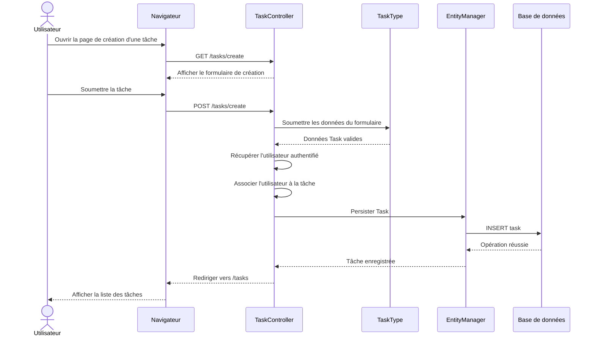

# ➕ Diagramme de séquence — Création d'une tâche

## 🎯 Objectif

Ce diagramme représente le parcours de création d'une tâche dans ToDo & Co.

Lors de la création, l'utilisateur authentifié est automatiquement associé à la nouvelle tâche.

L'utilisateur ne choisit donc pas lui-même le propriétaire de la tâche.

---

## 📊 Diagramme



---

## 👤 Association automatique de l'utilisateur

Après validation du formulaire, `TaskController` récupère l'utilisateur authentifié et l'associe à la nouvelle tâche.

Le principe est :

```text
Utilisateur authentifié
        ↓
Création de Task
        ↓
Task.user = utilisateur authentifié
        ↓
Persistance Doctrine
        ↓
INSERT en base de données
```

Cette association garantit que chaque nouvelle tâche possède obligatoirement un utilisateur.

La colonne `user_id` est définie comme `NOT NULL` dans la base de données.

---

## 🧩 Composants concernés

```text
src/
├── Controller/
│   └── TaskController.php
│
├── Entity/
│   └── Task.php
│
└── Form/
    └── TaskType.php
```

Doctrine assure ensuite la persistance de l'entité dans la base de données.
