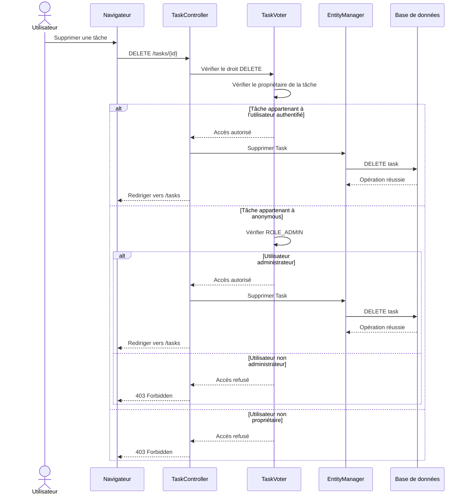

# 🗑️ Diagramme de séquence — Suppression d'une tâche

## 🎯 Objectif

Ce diagramme représente le parcours de suppression d'une tâche et les vérifications d'autorisation réalisées par `TaskVoter`.

La suppression dépend du propriétaire de la tâche et, dans le cas particulier des tâches `anonymous`, du rôle administrateur.

---

## 📊 Diagramme



---

## 🔐 Règles d'autorisation

La suppression d'une tâche est contrôlée par `TaskVoter`.

Trois situations sont distinguées :

### Tâche appartenant à l'utilisateur

L'utilisateur peut supprimer sa propre tâche.

### Tâche appartenant à un autre utilisateur

La suppression est refusée.

L'application retourne :

```text
403 Forbidden
```

### Tâche appartenant à `anonymous`

La suppression est uniquement autorisée à un utilisateur possédant le rôle :

```text
ROLE_ADMIN
```

---

## 🧩 Composants concernés

```text
src/
├── Controller/
│   └── TaskController.php
│
└── Security/
    └── Voter/
        └── TaskVoter.php
```

Doctrine intervient également pour supprimer l'entité `Task` de la base de données.

---

## 🎯 Rôle du diagramme

Ce diagramme permet de visualiser l'enchaînement entre :

```text
Utilisateur
     ↓
Navigateur
     ↓
TaskController
     ↓
TaskVoter
     ↓
EntityManager
     ↓
Base de données
```

Il permet notamment de comprendre où intervient la vérification des droits avant la suppression effective de la tâche.
