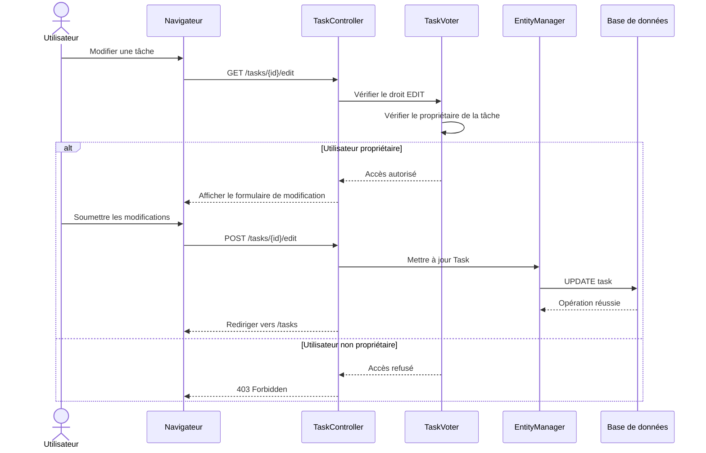

# 🔄 Diagramme de séquence — Modification d'une tâche

## 🎯 Objectif

Ce diagramme représente le parcours de modification d'une tâche.

Avant d'autoriser la modification, `TaskVoter` vérifie que l'utilisateur authentifié est bien le propriétaire de la tâche.

---

## 📊 Diagramme



---

## 🔐 Règle d'autorisation

La modification d'une tâche est autorisée uniquement si l'utilisateur authentifié est le propriétaire de la tâche.

`TaskVoter` effectue cette vérification avant que le contrôleur ne permette la modification.

L'auteur de la tâche n'est pas modifiable depuis le formulaire d'édition.

En cas de tentative d'accès à une tâche appartenant à un autre utilisateur, l'application retourne :

```text
403 Forbidden
```
