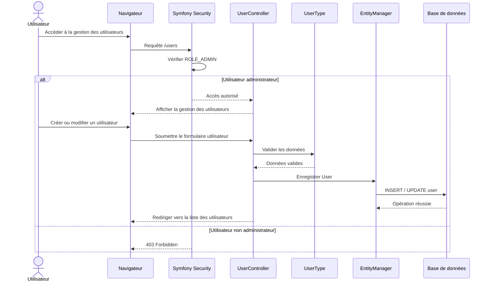

# 🔄 Diagramme de séquence — Gestion des utilisateurs

## 🎯 Objectif

Ce diagramme représente le parcours de gestion des utilisateurs dans ToDo & Co.

L'accès à la gestion des utilisateurs est réservé aux utilisateurs possédant le rôle `ROLE_ADMIN`.

Le diagramme présente notamment :

- la vérification du rôle administrateur ;
- l'accès à la page de gestion des utilisateurs ;
- la création ou la modification d'un utilisateur ;
- la validation du formulaire ;
- l'enregistrement des données en base de données.

---

## 📊 Diagramme



---

## 🔐 Règle d'autorisation

L'accès à la gestion des utilisateurs est protégé par le rôle :

```text
ROLE_ADMIN
```

Un utilisateur ne possédant pas ce rôle reçoit une réponse :

```text
403 Forbidden
```

L'autorisation est donc vérifiée avant l'accès aux fonctionnalités de gestion des utilisateurs.
