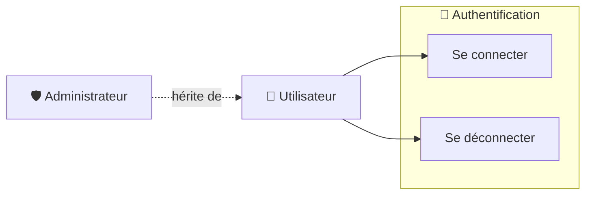

# 🔐 Use Case Diagram — Authentication

## 🎯 Objectif

Ce diagramme présente les cas d'utilisation liés à l'authentification des utilisateurs de ToDo & Co.

L'authentification permet à Symfony Security d'identifier l'utilisateur connecté et d'appliquer les règles d'accès correspondant à son rôle.

L'application distingue deux acteurs :

- **Utilisateur** ;
- **Administrateur**.

L'administrateur est une spécialisation de l'utilisateur : il bénéficie donc des mêmes fonctionnalités d'authentification.

---

## 📊 Diagramme de cas d'utilisation



---

## 👤 Utilisateur

L'utilisateur peut :

- se connecter à l'application ;
- se déconnecter de l'application.

Lors de la connexion, l'utilisateur fournit ses identifiants.

Symfony Security vérifie les informations fournies et identifie l'utilisateur correspondant.

Une fois authentifié, l'utilisateur peut accéder aux fonctionnalités correspondant à son rôle.

---

## 🛡️ Administrateur

L'administrateur possède le rôle `ROLE_ADMIN`.

Il dispose des mêmes fonctionnalités d'authentification qu'un utilisateur classique :

- se connecter ;
- se déconnecter.

Son rôle administrateur lui permet ensuite d'accéder aux fonctionnalités d'administration de l'application.

---

## 🔐 Règles d'authentification

| Fonctionnalité | Utilisateur | Administrateur |
| -------------- | :---------: | :------------: |
| Se connecter   |     ✅      |       ✅       |
| Se déconnecter |     ✅      |       ✅       |

L'authentification constitue le point d'entrée permettant ensuite à Symfony Security d'appliquer les règles d'autorisation.

---

## 🔄 Parcours principal

```text
Utilisateur

    ↓

Saisie des identifiants

    ↓

Symfony Security

    ↓

Recherche de l'utilisateur

    ↓

Vérification du mot de passe

    ↓

Authentification réussie

    ↓

Accès à l'application
```

En cas d'identifiants incorrects, l'authentification est refusée.

---

## 🧩 Composants concernés

Les principaux composants Symfony associés à l'authentification sont :

```text
src/

├── Controller/
│   └── SecurityController.php
│
├── Entity/
│   └── User.php
│
└── Security/
```

La configuration du système d'authentification est également définie dans la configuration Symfony Security.

---

## 🎯 Objectif du diagramme

Ce diagramme permet de visualiser les fonctionnalités d'authentification communes aux utilisateurs et aux administrateurs.

Il est complété par :

- `task-management.md` — cas d'utilisation liés à la gestion des tâches ;
- `user-management.md` — cas d'utilisation liés à la gestion des utilisateurs ;
- `data-model.md` — modèle physique de données ;
- `class-diagram.md` — structure des classes ;
- les diagrammes de séquence du dossier `sequence/` — déroulement détaillé des principaux parcours.
