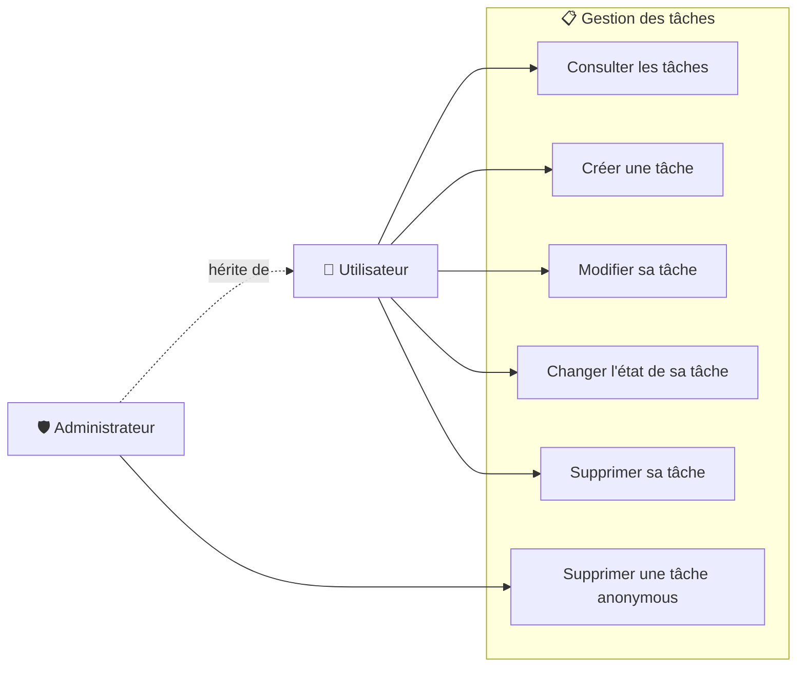

# 📋 Use Case Diagram — Task Management

## 🎯 Objectif

Ce diagramme présente les principaux cas d'utilisation liés à la gestion des tâches dans ToDo & Co.

L'application distingue deux acteurs :

- **Utilisateur** ;
- **Administrateur**.

L'administrateur est une spécialisation de l'utilisateur : il bénéficie donc des fonctionnalités accessibles à un utilisateur classique et dispose d'un droit supplémentaire concernant les tâches rattachées à l'utilisateur `anonymous`.

Les règles d'autorisation relatives aux tâches sont notamment contrôlées par `TaskVoter`.

---

## 📊 Diagramme de cas d'utilisation



---

## 👤 Utilisateur

L'utilisateur authentifié peut :

- consulter les tâches ;
- créer une tâche ;
- modifier une tâche dont il est l'auteur ;
- changer l'état d'une tâche dont il est l'auteur ;
- supprimer une tâche dont il est l'auteur.

Lors de la création d'une tâche, celle-ci est automatiquement associée à l'utilisateur authentifié.

L'auteur d'une tâche ne peut pas être modifié lors de son édition.

---

## 🛡️ Administrateur

L'administrateur dispose des mêmes fonctionnalités qu'un utilisateur classique.

Il possède également un droit spécifique :

- supprimer une tâche rattachée à l'utilisateur `anonymous`.

Les tâches `anonymous` correspondent aux tâches historiques créées avant la mise en place de l'association obligatoire entre une tâche et un utilisateur.

---

## 🔐 Règles d'autorisation

| Fonctionnalité                            | Utilisateur | Administrateur |
| ----------------------------------------- | :---------: | :------------: |
| Consulter les tâches                      |     ✅      |       ✅       |
| Créer une tâche                           |     ✅      |       ✅       |
| Modifier sa tâche                         |     ✅      |       ✅       |
| Modifier la tâche d'un autre utilisateur  |     ❌      |       ❌       |
| Changer l'état de sa tâche                |     ✅      |       ✅       |
| Supprimer sa tâche                        |     ✅      |       ✅       |
| Supprimer la tâche d'un autre utilisateur |     ❌      |       ❌       |
| Supprimer une tâche `anonymous`           |     ❌      |       ✅       |

Les autorisations sont appliquées au niveau de l'application par `TaskVoter`.

---

## 🔄 Parcours principaux

### Création

```text
Utilisateur authentifié
        ↓
Créer une tâche
        ↓
Association automatique
avec l'utilisateur connecté
```

### Modification

```text
Utilisateur authentifié
        ↓
Modifier une tâche
        ↓
Vérification du propriétaire
        ↓
Modification autorisée
```

### Suppression

```text
Utilisateur authentifié
        ↓
Supprimer une tâche
        ↓
Vérification du propriétaire
        ↓
Autorisé si l'utilisateur est propriétaire
```

Pour une tâche `anonymous` :

```text
Tâche anonymous
        ↓
Vérification du rôle
        ↓
ROLE_ADMIN ?
     ↙       ↘
   Oui       Non
    ↓         ↓
 Autorisé   Refusé
```

---

## 🧩 Composants concernés

Les principaux composants Symfony associés à ces cas d'utilisation sont :

```text
src/
├── Controller/
│   └── TaskController.php
│
├── Entity/
│   └── Task.php
│
└── Security/
    └── Voter/
        └── TaskVoter.php
```

---

## 🎯 Objectif du diagramme

Ce diagramme permet de visualiser les fonctionnalités liées aux tâches ainsi que la différence de droits entre un utilisateur classique et un administrateur.

Il est complété par :

- `authentication.md` — cas d'utilisation liés à l'authentification ;
- `user-management.md` — cas d'utilisation liés à la gestion des utilisateurs ;
- `data-model.md` — modèle physique de données ;
- `class-diagram.md` — structure des classes ;
- les diagrammes de séquence du dossier `sequence/` — déroulement détaillé des principaux parcours.
