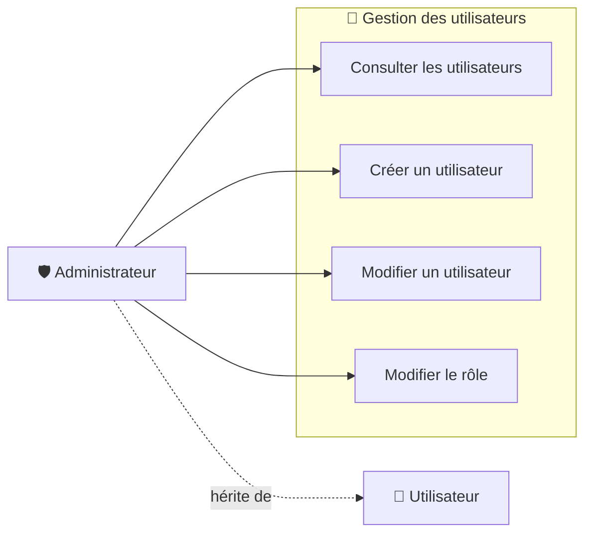

# 👥 Use Case Diagram — User Management

## 🎯 Objectif

Ce diagramme présente les cas d'utilisation liés à la gestion des utilisateurs de ToDo & Co.

La gestion des utilisateurs constitue une fonctionnalité d'administration.

Seuls les utilisateurs possédant le rôle `ROLE_ADMIN` peuvent accéder à ces fonctionnalités.

L'application distingue deux acteurs :

- **Utilisateur** ;
- **Administrateur**.

L'administrateur est une spécialisation de l'utilisateur.

---

## 📊 Diagramme de cas d'utilisation



---

## 👤 Utilisateur

Un utilisateur possédant uniquement le rôle `ROLE_USER` ne peut pas accéder aux fonctionnalités de gestion des utilisateurs.

Toute tentative d'accès aux pages d'administration est refusée.

```text
Utilisateur

    ↓

Accès à /users

    ↓

Vérification du rôle

    ↓

ROLE_ADMIN ?

    ↓

Non

    ↓

403 Forbidden
```

---

## 🛡️ Administrateur

L'administrateur possède le rôle `ROLE_ADMIN`.

Il peut accéder aux fonctionnalités de gestion des utilisateurs :

- consulter la liste des utilisateurs ;
- créer un utilisateur ;
- modifier un utilisateur ;
- modifier le rôle d'un utilisateur.

La gestion des rôles permet notamment d'attribuer :

```text
ROLE_USER
ROLE_ADMIN
```

à un utilisateur.

---

## 🔐 Règles d'autorisation

| Fonctionnalité             | Utilisateur | Administrateur |
| -------------------------- | :---------: | :------------: |
| Consulter les utilisateurs |     ❌      |       ✅       |
| Créer un utilisateur       |     ❌      |       ✅       |
| Modifier un utilisateur    |     ❌      |       ✅       |
| Modifier le rôle           |     ❌      |       ✅       |

L'accès aux pages de gestion des utilisateurs est protégé par le rôle `ROLE_ADMIN`.

---

## 🔄 Parcours principaux

### Consultation

```text
Administrateur

    ↓

Accéder à la gestion des utilisateurs

    ↓

Vérification ROLE_ADMIN

    ↓

Liste des utilisateurs
```

### Création

```text
Administrateur

    ↓

Créer un utilisateur

    ↓

Saisie des informations

    ↓

Choix du rôle

    ↓

Validation

    ↓

Utilisateur enregistré
```

### Modification

```text
Administrateur

    ↓

Modifier un utilisateur

    ↓

Modification des informations

    ↓

Modification éventuelle du rôle

    ↓

Validation

    ↓

Utilisateur mis à jour
```

---

## 🧩 Composants concernés

Les principaux composants Symfony associés à la gestion des utilisateurs sont :

```text
src/

├── Controller/
│   └── UserController.php
│
├── Entity/
│   └── User.php
│
└── Form/
    └── UserType.php
```

La configuration Symfony Security intervient également afin de protéger l'accès aux routes de gestion des utilisateurs.

---

## 🎯 Objectif du diagramme

Ce diagramme permet de visualiser les fonctionnalités d'administration liées aux utilisateurs et la restriction d'accès aux utilisateurs possédant le rôle `ROLE_ADMIN`.

Il est complété par :

- `authentication.md` — cas d'utilisation liés à l'authentification ;
- `task-management.md` — cas d'utilisation liés à la gestion des tâches ;
- `data-model.md` — modèle physique de données ;
- `class-diagram.md` — structure des classes ;
- les diagrammes de séquence du dossier `sequence/` — déroulement détaillé des principaux parcours.

```

```
