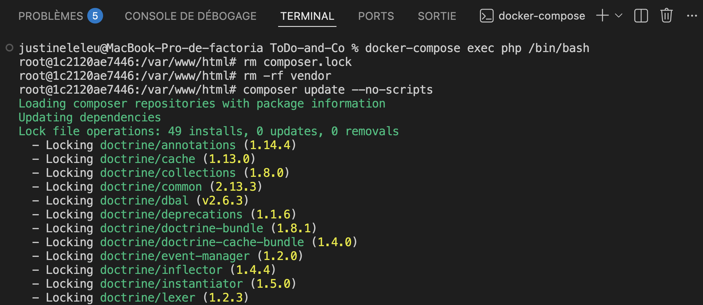
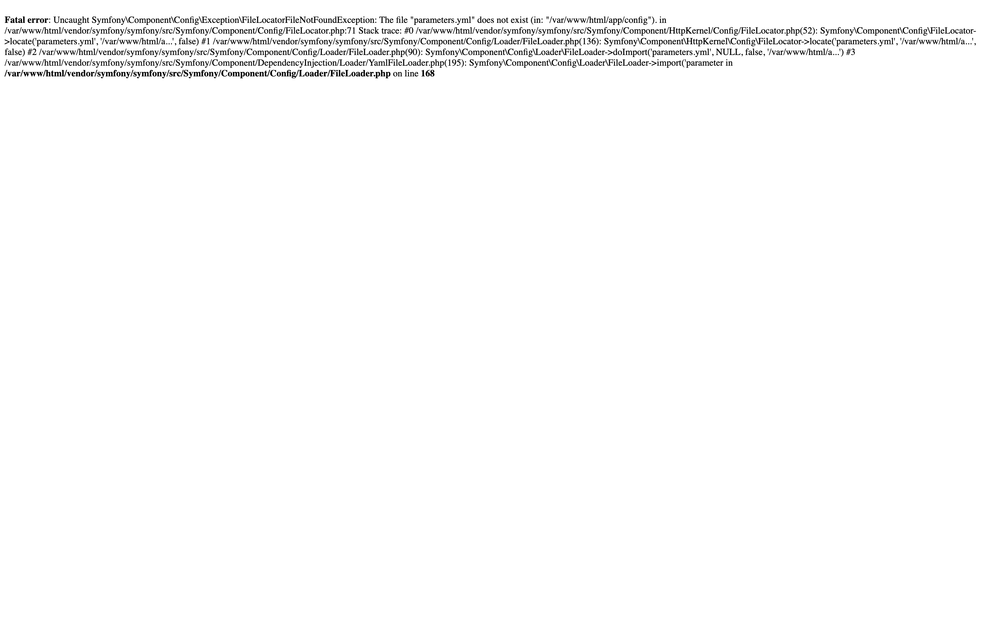

# 🚀 Migration Symfony 3.1 → Symfony 3.4 LTS

## Objectif

Cette étape consiste à migrer l'application originale de **Symfony 3.1.10** vers **Symfony 3.4 LTS**, dernière version de maintenance de la branche 3.x.

Cette migration constitue la première étape de la modernisation de l'application. Elle prépare les migrations successives vers Symfony 4.4 LTS, 5.4 LTS, 6.4 LTS puis 7.4.

---

## Pourquoi Symfony 3.4 ?

Symfony 3.4 est la dernière version LTS (Long Term Support) de la branche 3.x.

Cette étape intermédiaire permet de bénéficier des derniers correctifs de stabilité et facilite les migrations successives vers Symfony 4.4, 5.4, 6.4 puis 7.4, tout en limitant les ruptures de compatibilité.

---

## Contexte

Après la mise en place d'un environnement Docker indépendant, l'application ne pouvait pas être exécutée.

L'erreur suivante était affichée :

```text
Failed opening required 'vendor/autoload.php'
```

Cette erreur était liée à l'absence des dépendances Composer.

---

## Mise à jour des dépendances

Le fichier `composer.json` a été modifié afin de remplacer Symfony 3.1 par Symfony 3.4 LTS.

### Principales modifications

| Dépendance    | Avant  | Après                    |
| ------------- | ------ | ------------------------ |
| Symfony       | 3.1.\* | 3.4.\* (3.4.49 installé) |
| Twig          | 1.44.8 | 1.44.8                   |
| Doctrine ORM  | 2.6.\* | 2.6.\*                   |
| Doctrine DBAL | 2.6.\* | 2.6.\*                   |

Les autres dépendances ont été conservées afin de limiter les changements pendant cette première migration.

---

## Régénération des dépendances



L'ancien fichier `composer.lock` a été supprimé afin de reconstruire complètement les dépendances.

```bash
rm composer.lock
```

Les dépendances ont ensuite été réinstallées.

```bash
composer update --no-scripts
```

Un nouveau fichier `composer.lock` compatible avec Symfony 3.4 a alors été généré.

---

## Première exécution

Après l'installation des dépendances, Symfony démarre correctement mais une nouvelle erreur apparaît :



Cette erreur est attendue à ce stade de la migration.

Le fichier `parameters.yml` n'est pas versionné dans Git car il contient les paramètres propres à chaque environnement (connexion à la base de données, identifiants, etc.).

Il est volontairement ignoré par Git (`parameters.yml` est généré à partir de `parameters.yml.dist`).

Sa création et sa configuration seront réalisées lors de l'étape suivante consacrée à la configuration de la base de données.

---

## Vérifications réalisées

- installation des dépendances Composer ;
- génération du dossier `vendor/` ;
- génération d'un nouveau `composer.lock` ;
- chargement du noyau Symfony ;
- apparition de l'erreur liée à `parameters.yml`.

Ces vérifications montrent que la migration vers Symfony 3.4 est correctement engagée.

---

## Captures d'écran

Les captures réalisées pendant cette étape sont disponibles dans :

```text
docs/migration/screenshots/01-symfony-3.4/
```

---

## Travaux restant à réaliser

Les étapes suivantes permettront de :

- créer le fichier `parameters.yml` ;
- configurer la connexion MySQL ;
- générer le schéma Doctrine ;
- vérifier le bon fonctionnement de l'application.

---

## Conclusion

Cette première migration permet de mettre à niveau le framework vers Symfony 3.4 LTS tout en conservant l'architecture générale du projet.

L'application charge désormais correctement les dépendances et progresse jusqu'à l'étape de lecture de la configuration, ce qui confirme que la mise à jour des composants principaux a été réalisée avec succès.

La prochaine étape consistera à configurer la connexion à la base de données afin de finaliser la remise en fonctionnement de l'application sous Symfony 3.4.
