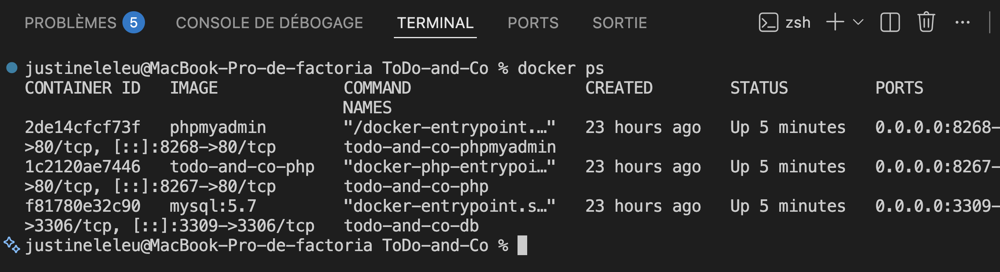
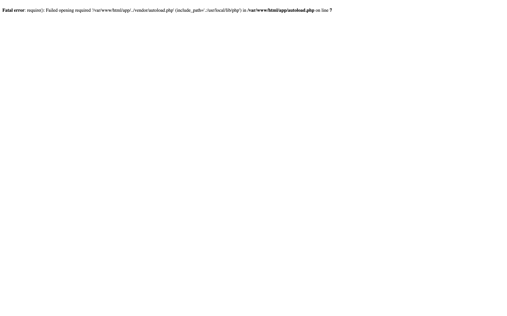

# 🐳 Mise à jour de l'environnement Docker

## Objectif

Avant d'entamer la migration de Symfony, un nouvel environnement Docker a été mis en place afin d'isoler le dépôt de modernisation de l'application originale.

Cette étape permet de faire fonctionner simultanément les deux projets sans conflit de ports, de conteneurs ou de volumes Docker.

---

## Modifications apportées

La mise à jour de l'environnement Docker a consisté à renommer les conteneurs, les volumes et les ports afin d'isoler le dépôt de modernisation du dépôt d'origine.

La figure suivante montre les conteneurs démarrés après la mise à jour :



Les éléments suivants ont été renommés :

| Élément              | Projet original             | ToDo-and-Co            |
| -------------------- | --------------------------- | ---------------------- |
| Container PHP        | projet8-todolist-php        | todo-and-co-php        |
| Container MySQL      | projet8-todolist-db         | todo-and-co-db         |
| Container phpMyAdmin | projet8-todolist-phpmyadmin | todo-and-co-phpmyadmin |

Les ports ont également été modifiés.

| Service     | Original | Modernisation |
| ----------- | -------: | ------------: |
| Application |     8167 |          8267 |
| phpMyAdmin  |     8168 |          8268 |
| MySQL       |     3308 |          3309 |

Le volume Docker a été renommé afin d'éviter tout partage involontaire des données entre les deux projets.

---

## Vérification

Les conteneurs démarrent correctement :

- PHP
- Apache
- MySQL
- phpMyAdmin

L'application est accessible à l'adresse :

```text
http://localhost:8267
```

phpMyAdmin est disponible à l'adresse :

```text
http://localhost:8268
```

---

## État du projet

À ce stade, l'environnement Docker est opérationnel, mais l'application ne peut pas encore être exécutée.

L'erreur suivante est affichée lors de l'accès à l'application :



Cette erreur est attendue : le dossier vendor/ n'existe pas encore, car les dépendances Composer n'ont pas encore été installées dans le dépôt de modernisation.

La résolution de ce problème sera réalisée lors de l'étape suivante consacrée à la migration vers Symfony 3.4 LTS.

---

## Conclusion

L'environnement Docker est désormais totalement indépendant de celui du dépôt d'origine.

Cette isolation permet de poursuivre la modernisation de l'application sans risque d'interférence avec le projet de référence.

L'étape suivante consistera à mettre à jour les dépendances Composer et à migrer l'application vers Symfony 3.4 LTS.
